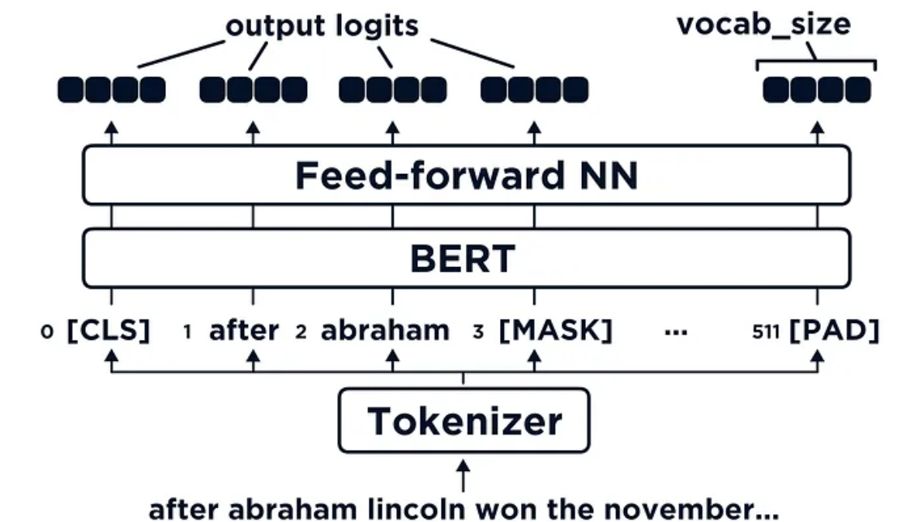

# Masked Language Modeling for Bangla Text Using BERT Model

- **Input**: Bangla Text with mask. i.e.: আমার সোনার বাংলা < blank > তোমায় ভালবাসি 
- **Output**: Input Text with Predicted mask. i.e.: আমার সোনার বাংলা আমি তোমায় ভালবাসি 
## Introduction

This repository contains the code and resources for a BERT (Bidirectional Encoder Representations from Transformers) model trained on a Bangla language dataset for Masked Language Modeling ( we can use any bangla ```.txt``` format dataset). Masked Language Model (MLM) involves providing BERT with a sentence and fine-tuning its weights to produce the same sentence as output. Prior to presenting the input sentence to BERT, masking done in certain tokens. Thus, the BERT model is used to generate the original sentence after receiving the masked input.

<p align="center"> Figure: In this image, before passing tokens into BERT — the lincoln token have masked, replacing it with [MASK] (Here in this project I use < blank >).</p>
So the task is actually inputting an incomplete sentence and asking BERT to complete it for us.

###### ***IT IS ADVISABLE TO UTILIZE PRETRAINED BERT MODEL FOR BETTER OUTPUT.***
## Project Structure
```bash
├── images
├── dataset
├── bert_module.py
├── config.py
├── data_preprocess.py
├── inference.py
├── logs
│   ├── bert_mlm_bangla.keras
│   ├── fit
│   └── vectorizer_layer.pkl
├── README.md
├── environment.yml
├── train.py
└── utils.py
```

## Installation

To use the Bangla BERT-MLM model in your project, follow these steps:

##### 1. Clone the repository:
```
git clone https://github.com/kamrul-brur/BERT-Bangla-MLM.git
```
##### 2. Install the required dependencies:
- 
    Create virtual environment and install dependiencies with the below command
```
conda env create -f environment.yml
```
- Then activate the environment
```
conda activate bert_mlm
```


## Edit config to change parameters according to the needs
In the ```config.py``` file, update the dataset path, log directory, model name, vectorizer layer name, max_epoch, and any other necessary parameters for training. Default values have been provided.
```bash
    MAX_LEN = 256
    BATCH_SIZE = 32
    LR = 0.001
    VOCAB_SIZE = 10000
    EMBED_DIM = 128
    NUM_HEAD = 8
    FF_DIM = 128
    NUM_LAYERS = 1
    EPOCHS = 100
    DATASET_PATH = "./dataset/dataset.txt"
    LOG_DIRECTORY = "logs"
    SAVED_MODEL_NAME = "bert_mlm_bangla.keras"
    SAVED_VECTORIZED_LAYER_NAME = "vectorizer_layer.pkl"
    TENSORBOARD_LOG_DIR = "logs/fit"
```
## Model Training and Performance Monitoring
- Run the ```train.py``` file using the command
```bash
python train.py
```
The training will be completed and log file is saved on the directory ```/logs```.

## View in tensorboard
- Traning metrics in tensorboard can be visualized by the following command.
```bash
tensorboard -logdir logs
```
Then click on the url given in terminal to monitor performance in tensorboard 


## Model Inference and Evaluation
- Write your input masked sentences in a txt file. ```i.e.: inputs.txt```
- In the ```ineference.py file```, change the path of the input file to accordingly.
```python
input_text_path = "dataset/inputs.txt"
```
- change the path of model and vectorizer_layer files if needed.
```python
vectorized_layer_path = os.path.join(config.LOG_DIRECTORY, config.SAVED_VECTORIZED_LAYER_NAME)
model_path = os.path.join(config.LOG_DIRECTORY, config.SAVED_MODEL_NAME)
```
- Run the train.py file using the command
```bash 
python ineference.py file
```


## Resources
- [Keras-team](https://github.com/keras-team/keras-io)
- [Bangla-BERT](https://huggingface.co/sagorsarker/bangla-bert-base)
- [Masked-Language Modeling With BERT](https://towardsdatascience.com/masked-language-modelling-with-bert-7d49793e5d2c)
- [Huggingface-BERT](https://huggingface.co/docs/transformers/model_doc/bert)

## Citation
```bibtex
@article{devlin2018bert,
  title={Bert: Pre-training of deep bidirectional transformers for language understanding},
  author={Devlin, Jacob and Chang, Ming-Wei and Lee, Kenton and Toutanova, Kristina},
  journal={arXiv preprint arXiv:1810.04805},
  year={2018}
}
```